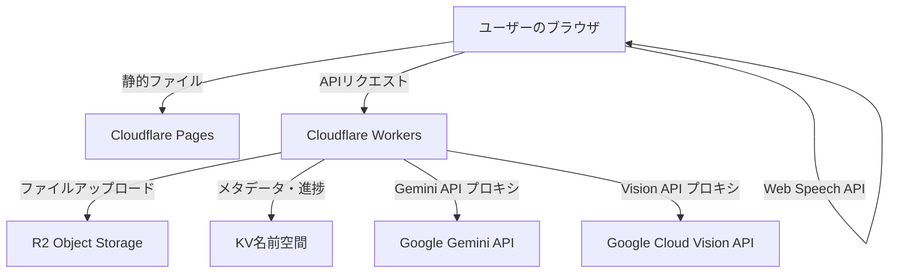

# Cloudflare Workers 版実装計画書 (案A: クライアントオフロード型)

## 概要
本計画書は、手書きマニュアル処理システムを Cloudflare Workers (TypeScript) + Cloudflare Pages (静的ホスティング) で実装するための詳細な手順を定義します。
案Aでは、重い処理 (PDFテキスト抽出、OCR、ドキュメント生成) をクライアントサイドまたは外部APIにオフロードし、Workers を API ゲートウェイとストレージ管理に特化させます。

これにより、Cloudflare の無料枠内で運用可能とし、サーバーサイドの Python 依存を解消します。

## アーキテクチャ全体図


## 前提条件
- Node.js 20+ と npm (または pnpm)
- TypeScript 5.0+
- Wrangler 4+ (Cloudflare Workers CLI)
- Cloudflare アカウント (無料枠で開始可能)
- Google Cloud プロジェクト (Vision API と Gemini API の有効化)

## フェーズとステップ

### フェーズ0: 準備
| ステップ | 内容 | ファイル |
|----------|------|----------|
| 0.1 | リポジトリのクリーンアップとディレクトリ構造作成 | `manual-maker-workers/` |
| 0.2 | 必要な開発ツールのインストール | - |
| 0.3 | git リポジトリの初期化（既存ならばスキップ） | - |

### フェーズ1: 基盤構築 (Steps 1-10)
| ステップ | 内容 | ファイル |
|----------|------|----------|
| 1.1 | `wrangler.toml` の作成 (R2, KV, 環境変数設定) | `wrangler.toml` |
| 1.2 | `package.json` の作成 (依存関係定義) | `package.json` |
| 1.3 | `tsconfig.json` の作成 | `tsconfig.json` |
| 1.4 | ディレクトリ構造の作成 | `src/`, `static/`, `src/lib/`, `src/routes/`, `src/services/`, `src/i18n/` |
| 1.5 | 型定義ファイル `src/lib/types.ts` の作成 | `src/lib/types.ts` |
| 1.6 | ユーティリティファイル `src/lib/utils.ts` の作成 (uuidv4, バリデーション等) | `src/lib/utils.ts` |
| 1.7 | 設定管理ファイル `src/lib/config.ts` の作成 | `src/lib/config.ts` |
| 1.8 | ストレージラッパー `src/lib/storage.ts` の作成 (R2 と KV のラップ) | `src/lib/storage.ts` |
| 1.9 | ベースの Workers アプリケーション `src/index.ts` の作成 (Hono セットアップ) | `src/index.ts` |
| 1.10 | 基本的なヘルスチェックと設定エンドポイントの実装 | `src/routes/health.ts`, `src/routes/config.ts` |

### フェーズ2: コア API 実装 (Steps 11-20)
| ステップ | 内容 | ファイル |
|----------|------|----------|
| 2.1 | アップロードエンドポイントの実装 (ファイルバリデーション、R2 アップロード、KV メタデータ保存) | `src/routes/upload.ts` |
| 2.2 | Gemini API プロキシエンドポイントの実装 (APIキーは環境変数から取得、リクエストを転送) | `src/routes/gemini.ts` |
| 2.3 | Vision API プロキシエンドポイントの実同様 (画像データを受け取り Vision API に転送) | `src/routes/vision.ts` |
| 2.4 | 処理ジョブのエンキューエンドポイント (メタデータ更新、進捗初期化) | `src/routes/process.ts` |
| 2.5 | 処理結果取得エンドポイント (KV または R2 から結果を取得) | `src/routes/results.ts` |
| 2.6 | 結果ダウンロードエンドポイント (R2 からファイルをストリーミング) | `src/routes/download.ts` |
| 2.7 | セキュリティステータスエンドポイント (PII マスキング設定等) | `src/routes/security.ts` |
| 2.8 | 多言語対応エンドポイント (言語リスト取得、翻訳取言) | `src/routes/i18n.ts` |
| 2.9 | Mermaid.js 関連エンドポイント (バリデーション、変換はブラウザ側に委譲のため、ここではメタデータ保存のみ) | `src/routes/mermaid.ts` |
| 2.10 | エラーハンドリングミドルウェアの実装 | `src/lib/middleware.ts` |

### フェーズ3: 静的フロントエンド実装 (Steps 21-30)
| ステップ | 内容 | ファイル |
|----------|------|----------|
| 3.1 | 基本的な HTML テンプレートの作成 (Cloudflare Pages 用) | `static/index.html` |
| 3.2 | CSS フレームワーク (例: Pico.css または独自) の設定 | `static/css/style.css` |
| 3.3 | メインアプリケーションロジックの作成 (ファイル選択、アップロード、進捗表示) | `static/js/app.js` |
| 3.4 | PDF.js の統合 (PDF テキスト抽出機能) | `static/js/app.js` または別ファイル |
| 3.5 | Mermaid.js エディタの統合 (フローチャート編集・プレビュー) | `static/js/app.js` |
| 3.6 | マークダウン変換ライブラリの組み込み (例: marked) | `static/js/app.js` |
| 3.7 | 国際化対応 (i18n) の実装 | `static/js/i18n.js` または `app.js` に組み込み |
| 3.8 | Web Speech API または 外部 TTS API への接続 (音声合成) | `static/js/app.js` |
| 3.9 | レスポンシブデザインとアクセシビリティ対応 | `static/css/style.css` |
| 3.10 | ビルドスクリプトの作成 (開発用と本番用) | `package.json` の scripts |

### フェーズ4: 設定・シークレット管理 (Steps 31-35)
| ステップ | 内容 | ファイル |
|----------|------|----------|
| 4.1 | 開発用シークレットファイルのテンプレート作成 | `.dev.vars.example` |
| 4.2 | 必要なシークレットのリストアップ (GEMINI_API_KEY, GOOGLE_API_KEY 等) | - |
| 4.3 | wrangler でのシークレット設定手順のドキュメント化 | - |
| 4.4 | ローカル開発時のシークレットの読み込み方法 | `wrangler dev` 時の `.dev.vars` |
| 4.5 | 本番デプロイ時のシークレット設定の確認 | `wrangler secret put` |

### フェーズ5: テストと品質保証 (Steps 36-40)
| ステップ | 内容 | ファイル |
|----------|------|----------|
| 5.1 | ユニットテストフレームワークの設定 (Vitest または Jest) | - |
| 5.2 | API ルートのユニットテストの作成 | `src/routes/*.test.ts` |
| 5.3 | ユーティリティ関数のテスト | `src/lib/*.test.ts` |
| 5.4 | 統合テストの作成 (アップロードから結果取得までのフロー) | `src/tests/integration/` |
| 5.5 | ローカル開発での wrangler dev による動作確認 | - |
| 5.6 | Cloudflare Pages と Workers の連携確認 | - |
| 5.7 | エッジケースとエラーハンドリングのテスト | - |
| 5.8 | 性能テスト (無料枠内でのリクエスト数シミュレーション) | - |
| 5.9 | セキュリティスキャン (依存関係の脆弱性チェック) | - |
| 5.10 | ドキュメント化 (README の更新と API ドキュメント生成) | `README.md`, `docs/` |

### フェーズ6: デプロイと運用 (Steps 41-45)
| ステップ | 内容 | ファイル |
|----------|------|----------|
| 6.1 | Cloudflare プロジェクトの作成 (Pages と Workers) | - |
| 6.2 | R2 バケットの作成とバインド設定 | - |
| 6.3 | KV 名前空間の作成とバインド設定 | - |
| 6.4 | シークレットの Cloudflare への設定 | - |
| 6.5 | 初回デプロイ (`wrangler pages publish` と `wrangler deploy`) | - |
| 6.6 | カスタムドメインの設定 (オプション) | - |
| 6.7 | モニタリングとアラームの設定 (Cloudflare ダッシュボード) | - |
| 6.8 | ログ収集の設定 (Workers Logs) | - |
| 6.9 | バックアップ戦略のドキュメント化 (R2 と KV のエクスポート) | - |
| 6.10 | 運用マニュアルとトラブルシューティングガイドの作成 | `docs/deployment/index.md` |

## 詳細な実装仕様

### 1. `wrangler.toml` の構成例
```toml
name = "manual-processor"
main = "src/index.ts"
compatibility_date = "2024-01-01"

# R2 バインディング
[[r2_buckets]]
binding = "BUCKET"
bucket_name = "manual-processor-files"

# KV バインディング
[[kv_namespaces]]
binding = "PROCESSING_KV"
id = "your-kv-namespace-id"

# 環境変数 (バインディングではない、シークレットは別途設定)
[vars]
DEFAULT_LANGUAGE = "ja"
MAX_FILE_SIZE_MB = "50"
WEB_UPLOAD_MAX_MB = "100"
GEMINI_MODEL_NAME = "gemini-1.5-flash"

# Pages Functions の設定（オプション、今回は Workers 単体なので不要かも）
[upload]
# 省略可能

[durable_objects]
# 案Aでは Durable Objects は使用しない (有料枠のため)
# 代わりに KV ポーリングまたは SSE を使用
```

### 2. `package.json` の構成例
```json
{
  "name": "manual-maker-workers",
  "version": "2.0.0",
  "description": "Manual Maker - Cloudflare Workers版 (クライアントオフロード型)",
  "main": "src/index.ts",
  "scripts": {
    "dev": "wrangler dev",
    "deploy": "wrangler deploy",
    "build": "wrangler build",
    "typecheck": "tsc --noEmit",
    "test": "vitest",
    "pages:dev": "wrangler pages dev static",
    "pages:deploy": "wrangler pages deploy static --project-name=manual-processor"
  },
  "dependencies": {
    "hono": "^4.0.0",
    "zod": "^3.22.0",
    "ai": "^2.0.0"
  },
  "devDependencies": {
    "@cloudflare/workers-types": "^4.20240801.0",
    "typescript": "^5.3.0",
    "wrangler": "^4.0.0",
    "vitest": "^1.0.0"
  }
}
```

### 3. 型定義 `src/lib/types.ts`
```typescript
interface Env {
  BUCKET: R2Bucket;
  PROCESSING_KV: KVNamespace;
  GEMINI_API_KEY: string;
  GOOGLE_API_KEY: string;
  GOOGLE_CLOUD_PROJECT_ID: string;
}

interface UploadedFile {
  fileId: string;
  filename: string;
  sizeMb: number;
  path: string; // R2 key
  uploadedAt: string; // ISO string
}

interface ProcessingOptions {
  compactLayout?: boolean;
  useEmojis?: boolean;
  promptLayout?: string;
  promptStrictMode?: boolean;
  promptHasDiagrams?: boolean;
  promptLowQualityMode?: boolean;
  baseUrl?: string;
}

interface ProcessingResult {
  fileId: string;
  status: 'pending' | 'processing' | 'completed' | 'failed';
  progress: number; // 0-100
  stage: string;
  result?: {
    markdown?: string;
    html?: string;
    // 他の出力形式はクライアント側で変換
  };
  error?: string;
}
```

### 4. アップロードルートの実装例 (`src/routes/upload.ts`)
```typescript
import { Hono } from 'hono';
import type { Env, UploadedFile } from '../lib/types';
import { uuidv4 } from '../lib/utils';

export function registerUploadRoutes(app: Hono<{ Bindings: Env }>) {
  app.post('/api/upload', async (c) => {
    try {
      const body = await c.req.parseBody();
      const file = body['file'];

      if (!file || !(file instanceof File)) {
        return c.json({ error: 'No file provided' }, 400);
      }

      const filename = file.name;
      if (!filename.toLowerCase().endsWith('.pdf')) {
        return c.json({ error: 'Only PDF files are allowed' }, 400);
      }

      const maxSize = parseInt(c.env.WEB_UPLOAD_MAX_MB || '100', 10) * 1024 * 1024;
      if (file.size > maxSize) {
        return c.json({
          error: `File size exceeds limit`
        }, 400);
      }

      const fileId = uuidv4();
      const arrayBuffer = await file.arrayBuffer();

      // アップロードを R2 に
      const key = `uploads/${fileId}/${filename}`;
      await c.env.BUCKET.put(key, arrayBuffer, {
        httpMetadata: {
          contentType: 'application/pdf'
        }
      });

      // メタデータを KV に保存
      const meta: UploadedFile = {
        fileId,
        filename,
        sizeMb: Math.round(file.size / 1024 / 1024 * 100) / 100,
        path: key,
        uploadedAt: new Date().toISOString()
      };

      await c.env.PROCESSING_KV.put(`uploaded:${fileId}`, JSON.stringify(meta));

      return c.json(meta);
    } catch (error) {
      console.error('Upload error:', error);
      return c.json({ error: 'Upload failed' }, 500);
    }
  });

  // アップロード済みファイル一覧取得
  app.get('/api/uploads', async (c) => {
    try {
      const list = await c.env.PROCESSING_KV.list({ prefix: 'uploaded:' });
      const uploads: UploadedFile[] = [];

      for (const key of list.keys) {
        const data = await c.env.PROCESSING_KV.get(key.name, 'json');
        if (data) {
          uploads.push(data as UploadedFile);
        }
      }

      return c.json({ uploads });
    } catch (error) {
      console.error('List uploads error:', error);
      return c.json({ error: 'Failed to list uploads' }, 500);
    }
  });
}
```

### 5. Gemini プロキシルートの実装例 (`src/routes/gemini.ts`)
```typescript
import { Hono } from 'hono';
import type { Env } from '../lib/types';

export function registerGeminiRoutes(app: Hono<{ Bindings: Env }>) {
  app.post('/api/gemini/:endpoint', async (c) => {
    try {
      const endpoint = c.req.param('endpoint');
      const apiKey = c.env.GEMINI_API_KEY;
      if (!apiKey) {
        return c.json({ error: 'Gemini API key not configured' }, 500);
      }

      // リクエストボディを取得
      const body = await c.req.json();

      // Gemini API エンドポイントを構築
      const url = `https://generativelanguage.googleapis.com/v1beta/models/${c.env.GEMINI_MODEL_NAME}:${endpoint}?key=${apiKey}`;

      // Gemini API にプロキシ
      const response = await fetch(url, {
        method: 'POST',
        headers: {
          'Content-Type': 'application/json',
        },
        body: JSON.stringify(body),
      });

      if (!response.ok) {
        const errorData = await response.json();
        return c.json({ error: 'Gemini API error', details: errorData }, response.status);
      }

      const result = await response.json();
      return c.json(result);
    } catch (error) {
      console.error('Gemini proxy error:', error);
      return c.json({ error: 'Proxy failed' }, 500);
    }
  });
}
```

### 6. 静的フロントエンドの主要機能 (`static/js/app.js` の概要)
```javascript
// 重要な機能のみ抜粋
class ManualProcessorApp {
  constructor() {
    this.state = {
      fileId: null,
      progress: 0,
      stage: '',
      result: null
    };
    this.initEventListeners();
  }

  async handleFileUpload(file) {
    // ファイルバリデーション
    // アップロードAPIを呼び出し
    // ファイルIDを取得
    // PDF.js でテキスト抽出開始
  }

  async extractTextWithPdfJs(pdfData) {
    // PDF.js を使用してテキストを抽出
    // 抽出結果を Gemini API に送信 (プロキシ経由)
  }

  async processWithGemini(prompt, text) {
    // 自分の Workers の /api/gemini/generateContent エンドポイントを呼び出し
    // 結果を取得して状態を更新
  }

  async updateProgress() {
    // KV または SSE をポーリングして進捗を取得
    // UI を更新
  }

  async downloadResult(type) {
    // 結果ダウンロードAPIを呼び出し
    // ブラウザでファイルを保存または変換
  }

  // イベントリスナーの設定等
}

// DOMContentLoaded で初期化
```

## 依存関係の詳細
- **本番依存**:
  - `hono`: 軽量Webフレームワーク
  - `zod`: スキーマバリデーション
  - `ai`: Google AI SDK (ただし、ここでは Fetch を直接使用するため、オプション)
- **開発依存**:
  - `@cloudflare/workers-types`: TypeScript 用型定義
  - `typescript`: TypeScript コンパイラ
  - `wrangler`: Cloudflare CLI
  - `vitest`: ユニットテストフレームワーク
  - （オプション）`eslint`, `prettier`

## 無料枠内での運用見積もり
| リソース | 無料枠 | 想定使用量 | 備考 |
|----------|--------|------------|------|
| Workers リクエスト | 10万/日 | 1000-5000/日 | ファイル1件あたり数回のリクエスト |
| R2 ストレージ | 10GB | 1-5GB | 処理済みファイルはユーザーがダウンロード後削除前提 |
| R2 Class A 操作 | 100万/月 | 10万/月 | アップロード・メタデータ保存 |
| R2 Class B 操作 | 1000万/月 | 50万/月 | ファイルリスト取得等 |
| KV 読み込み | 10万/日 | 5万/日 | メタデータ読み込み・進捗ポーリング |
| KV 書き込み | 1000/日 | 500/日 | メタデータ書き込み・進捗更新 |
| Pages リクエスト | 50万/月 | 10万/月 | 静的ファイル配信 |
| Gemini API | 要確認 | 要確認 | 無料枠あり (要調査) |
| Vision API | 要確認 | 要確認 | 無料枠あり (要調査) |

## リスクと対策
| リスク | 影響 | 対策 |
|--------|------|------|
| ブラウザでの PDF テキスト抽出失敗 | スキャン品質依存 | pdf.js の設定調整、失敗時はサーバーサイド OCR へのフォールバック検討 (ただし有料) |
| Gemini/Vision API の無料枠超過 | 予期せぬコスト | 使用量モニタリング、上限アラート設定 |
| KV 書き込み制限に到達 | 進捗更新停止 | 書き込み間隔を広げる、バッチ更新、または SSE への移行 |
| 古いブラウザでの非互換 | ユーザー体験低下 | 必要最低限のブラウザバージョンを明示、ポリフィルの使用 |
| Workers の CPU 制限超過 | リクエストタイムアウト | 重い処理は一切 Workers で行わない設計を徹底 |

## 成功基準
1. `wrangler dev` でローカル開発が可能
2. `wrangler publish` で Cloudflare Pages に静的サイトがデプロイ可能
3. `wrangler deploy` で Workers がデプロイ可能
4. ファイルアップロードから結果ダウンロードまでの一連のフローがブラウザで完結
5. 無料枠内での運用が見込める（想定使用量が無料枠以内）
6. 基本的な機能 (PDF アップロード、テキスト抽出、要約、マークダウン出力) が動作する

## 次のステップ
この計画書に基づいて、タスクリストを作成し、実装に移ります。
まずはリポジトリのクリーンアップとディレクトリ構造作成から開始します。